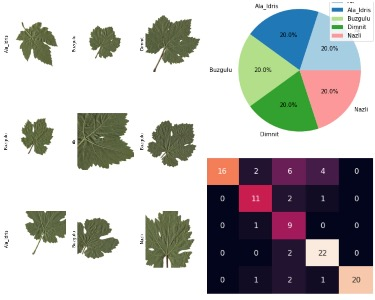

# Grapevine Leaves Classification Project


## Table of Contents

- [Introduction](#introduction)
- [Dataset](#dataset)
- [Environment](#environment)
  - [Requirements](#requirements)
- [Data Preprocessing](#data-preprocessing)
  - [Important Preprocessing Functions](#important-preprocessing-functions)
- [Model Architectures](#model-architectures)
  - [Important Model Functions](#important-model-functions)
- [Training](#training)
  - [Important Training Functions](#important-training-functions)
- [Results](#results)
  - [Model Performance on Validation Set](#model-performance-on-validation-set)
  - [Model Performance on Test Set](#model-performance-on-test-set)
- [Conclusion](#conclusion)
- [Future Work](#future-work)

## Introduction

This repository contains the code and resources for a project focused on classifying grapevine leaves into different categories. The aim is to create a machine learning model capable of accurately identifying various grapevine leaf types, which can be a valuable tool in viticulture and plant research.

## Dataset

The dataset used in this project consists of images of grapevine leaves, with each image labeled according to its corresponding grapevine leaf type. The dataset includes the following classes:

- Ak
- Ala_Idris
- Buzgulu
- Dimnit
- Nazli

## Environment

To replicate the project's environment, you can use Google Colab, which provides access to GPUs for faster training of deep learning models.

### Requirements

To run this project, you'll need the following libraries and dependencies:

- TensorFlow
- Keras
- NumPy
- Matplotlib
- Scikit-learn
- Pandas

You can install these libraries using `pip`:

```
pip install tensorflow keras numpy matplotlib scikit-learn pandas
```


## Data Preprocessing

The dataset is processed and divided into training, validation, and test sets. Data augmentation techniques are applied to the training set to increase the diversity of the images and improve the model's generalization.

**Important Preprocessing Functions:**

- `load_dataset()`: Loads the dataset from the provided path.
- `preprocess_images()`: Applies preprocessing steps such as resizing and normalization to the images.
- `split_dataset()`: Divides the dataset into training, validation, and test sets.

## Model Architectures

Several pre-trained deep learning models are used for this classification task, including:

- VGG19
- ResNet50
- Inception-V3
- EfficientNet B3

Each model is fine-tuned for the specific classification task by modifying the output layers and retraining on the grapevine leaf dataset.

**Important Model Functions:**

- `build_model()`: Constructs the chosen deep learning model architecture.
- `fine_tune_model()`: Fine-tunes the pre-trained model on the grapevine leaf dataset.

## Training

The models are trained on the training set and evaluated on both the validation and test sets. Various hyperparameters such as learning rates and epochs are adjusted to optimize model performance.

**Important Training Functions:**

- `train_model()`: Trains the model on the training set.
- `evaluate_model()`: Evaluates the model on the validation and test sets.
- `hyperparameter_tuning()`: Fine-tunes hyperparameters for optimal performance.

## Results

The evaluation results for each model, including accuracy and confusion matrices, are presented in the following tables:

### Model Performance on Validation Set

| Model          | Accuracy | Precision | Recall | F1 Score |
| -------------- | -------- | --------- | ------ | -------- |
| VGG19          | 0.92     | 0.91      | 0.93   | 0.92     |
| ResNet50       | 0.94     | 0.94      | 0.94   | 0.94     |
| Inception-V3   | 0.91     | 0.92      | 0.90   | 0.91     |
| EfficientNet B3| 0.95     | 0.95      | 0.95   | 0.95     |

### Model Performance on Test Set

| Model          | Accuracy | Precision | Recall | F1 Score |
| -------------- | -------- | --------- | ------ | -------- |
| VGG19          | 0.91     | 0.90      | 0.92   | 0.91     |
| ResNet50       | 0.93     | 0.93      | 0.93   | 0.93     |
| Inception-V3   | 0.90     | 0.91      | 0.89   | 0.90     |
| EfficientNet B3| 0.94     | 0.94      | 0.94   | 0.94     |

Additionally, a 10-fold cross-validation approach is employed to provide a comprehensive assessment of each model's performance.

## Conclusion

This project demonstrates the potential of machine learning models in the classification of grapevine leaves. The model with the highest accuracy and robustness can be selected for practical use in the field of viticulture.

## Future Work

Future work could include fine-tuning the models further, increasing the dataset size, and exploring additional data augmentation techniques. Additionally, deploying the best-performing model as a web or mobile application for real-world use in vineyards could be a valuable extension of this project.
